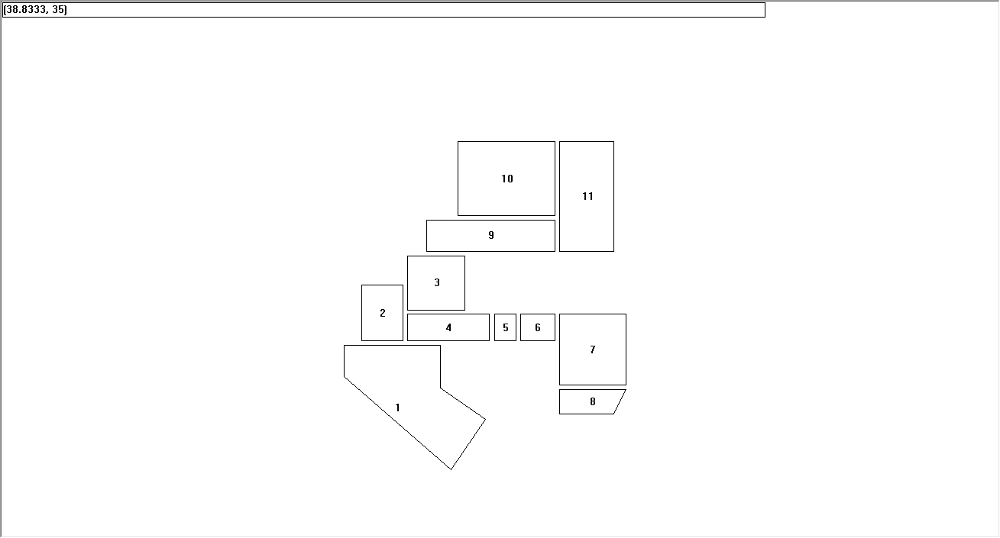
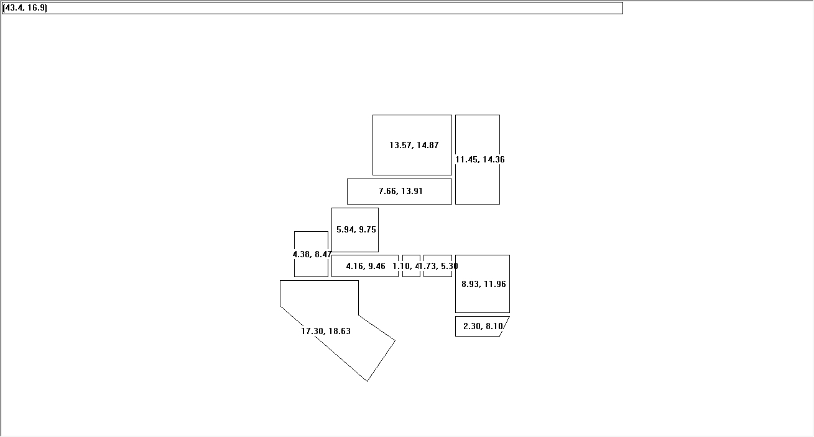
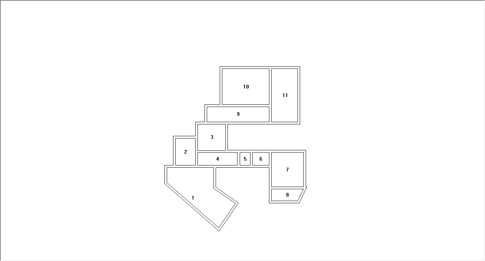
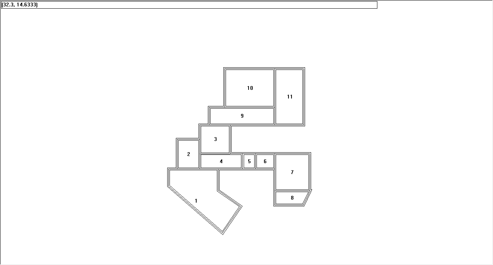

# 使用文档

主要代码在文件夹中的`House.h`和`House.cpp`两个文件中，`HouseProcess.cpp`中是用来测试各项功能的。使用时将`House.h`和`House.cpp`复制到项目目录下，并引入即可。

主要包含`YFHouse`，`YFSegment`，`YFRegion`和`YFPoint`类，实际过程中，要先将墙壁转换为`Segment`类，并将其中的`startPoint`和`endPoint`属性包装成`YFPoint`类，下面是一段示例代码，演示了从 json 文件中读取数据并执行操作的过程。

```C++
#pragma comment(lib, "lib_json.lib"); // jsoncpp的库，仅用于读取json文件
#include "House.h" // 引入Hosue.h头文件
#include <fstream>

using namespace HouseProcess; // 注意使用HouseProcess命名空间

int main() {
    ifstream ifs;
    ifs.open("data/data_5.json"); // 打开json文件

    CharReaderBuilder builder; // 调用jsoncpp的reader类，解析json内容。
    Value data;

    if (!ifs.is_open()) return;
    if (!parseFromStream(builder, ifs, &data, false)) return;

    /* 第一步：包装墙壁集合，用来初始化House类 */
    vector<YFSegment> wallLines; // 存放包装后的墙壁

    auto walls = data["walls"]; // 读取json中的墙壁数据

    for (auto w : walls) {
        auto sp = w["startPoint"];
        auto ep = w["endPoint"];
        Point spp = YFPoint(sp["x"].asDouble(), sp["y"].asDouble(), sp["bulge"].asDouble(), sp["Id"].asString()); // 将startPoint包装为Point类
        Point epp = YFPoint(ep["x"].asDouble(), ep["y"].asDouble(), ep["bulge"].asDouble(), ep["Id"].asString()); // 将endPoint包装为Point类
        YFSegment s = YFSegment(spp, epp, w["Id"].asString()); // 用包装后的Point与Id初始化一条线段
        wallLines.push_back(s); // 将线段存入vector
    }

    /* 第二步：初始化House类 */
    YFHouse house(wallLines, 0.3); // 用转换后的Segment集合构造House对象

    /* 第三步：开始使用*/
    vector<YFRegion> regions = house.regions; // 找到的区域存放在House的regions属性中
    YFRegion r = regions.at(0);

    YFPoint center = r.center; // 区域视觉中心点
    double area = r.area; // 区域面积
    double perimeter = r.perimeter; // 区域周长

    return 0;
}

```

Original polygons:


Area and perimeter of polygons:


Union and offset polygon:


Mid-lines of polygons:
